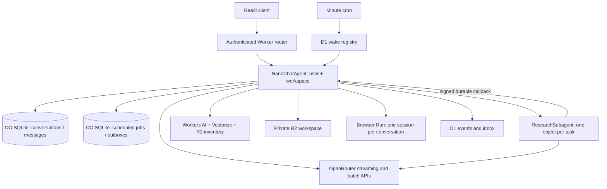

# Architecture

## Ownership and isolation

The coordinator name is a SHA-256 hash of the workspace/user tuple. Every conversation is a row within that owner's SQLite database. WebSocket attachments retain the conversation binding through hibernation. Public routes authenticate first; internal requests carry expiring HMAC envelopes whose identity must match the durable owner.

The default authentication adapter supports one owner. A trusted service binding can resolve multiple users and revalidate active authority. Socket commands and background observation revalidate authority, because an object and its sockets can outlive a login or membership change.

Workspace file prefixes and memory namespaces use collision-resistant scope hashes. Retrieval checks access before exposing hits, reranking, or hydration. A vector index is not an authorization system.

## Conversation kernel

`src/agent-core` implements SQLite history, wire frames, reconnect replay, and turn streaming. `src/action-library/loop.ts` owns the AI SDK loop and typed partial failures. Tool arguments, call IDs, results, and provider replay metadata remain available after a later generation error. The coordinator owns each active turn by conversation and request ID.

A provider await permits other object events to interleave. SQLite state and explicit ownership checks protect those seams. External model calls are not wrapped in a long `blockConcurrencyWhile`. Constructor initialization gates schema and local recovery only.

## Research lifecycle

The admission ledger doubles as the owner concurrency limit. A task is persisted before dispatch. The child persists the dispatch, records an absolute deadline, and arms its alarm before model execution. On completion, it saves a report outbox before contacting the parent. Failed callbacks get fresh stubs and bounded retries without repeating model work.

Cancellation is persisted on both sides. Cancel-before-dispatch leaves an expiring child tombstone. The parent retries cancellation deliveries and ignores late results for cancelled work. Batch metadata and retry intent survive object reconstruction. Synthesis uses a stable delivery ID and waits when a foreground turn owns the conversation.

## Shared scheduler and maintenance

The parent SQLite schema is version 10, including durable wake observation windows and admission records. Every parent timer is a row in `scheduled_jobs`. The single platform alarm runs a bounded due slice and rearms to the earliest remaining job. Summarization, titles, compression, consolidation, wake checks, reminders, research deadlines, synthesis, and cleanup share this scheduler.

Housekeeping tasks persist request payloads, dedupe keys, batch receipts, result identity, attempts, and expiry. Batch submission and polling occur in separate alarms. Memory summaries and insights track source provenance so stale or forgotten sources cannot reappear through a late result.

## Memory and integration boundaries

R2 holds an exact remote inventory; Vectorize provides similarity; DO SQLite owns source links, warm/cold tiers, deletion intent, and forget barriers. Consolidation stages insights cold until their result is complete, then archives cited sources to the cold tier. Forgetting an insight restores surviving sources. Forgetting source content follows transitive provenance and keeps cleanup retries durable.

Generic seams are `RetrievalAdapter`, the authentication service, proactive observers, inbox publication, model configuration, and MCP servers. The bundled implementation searches private files and observes authenticated workspace events. It contains no application-specific database catalog, permissions policy, or business workflow.

The optional `BROWSER` binding gives the foreground coordinator native browser tools. `BrowserSessions` stores a remote session ID and observed-page metadata in the owning object's key/value storage under a conversation key, serializes operations within that conversation, and disconnects CDP between calls. Cookies and live pages remain in Cloudflare's browser until explicit closure or idle expiry. Website actions use the existing durable approval flow; research children retain their existing read-only workspace toolset. See [browsing](docs/browsing.md).

## Source map

| Area                             | Location                                                          |
| -------------------------------- | ----------------------------------------------------------------- |
| Routing/authentication           | `src/server.ts`, `src/auth.ts`                                    |
| Parent/child objects             | `src/durable-objects/NanoChatAgent.ts`, `ResearchSubagent.ts`     |
| History/stream protocol          | `src/agent-core/`                                                 |
| Durable jobs and research ledger | `src/durable-objects/assistant/`                                  |
| Memory and batch transports      | `src/utils/memoryClient.ts`, `openrouterBatch.ts`                 |
| Tool policy and approvals        | `src/action-library/helpers.ts`, `assistant/toolConfirmations.ts` |
| Proactive checks                 | `src/services/proactive/`, `src/scheduled/`                       |
| Generic file retrieval           | `src/services/retrieval/`, `src/storage/workspace.ts`             |
| Invocation tracing               | `src/telemetry/`                                                  |
| Browser transport and views      | `src/hooks/`, `src/app.tsx`                                       |
