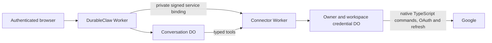

# External service connectors

Google Workspace runs in the cloud while Macs are offline. In **Connections → External services**, select the Google services to authorize, choose **Connect Google Workspace**, and complete the consent popup. Gmail is selected initially. The integration supports gogcli's Google API read/write command surface through a generated catalog, including sending, drafts, labels, calendar changes, document editing and file transfers.

Every generic gogcli command requires exact approval in the web app or through the approval buttons in the owner's linked Telegram chat. The three separately audited Gmail search/message/thread tools can read directly under the connected account's grant. A Google grant does not replace DurableClaw's action approval, and email or document content cannot approve an action.

## Runtime choice



The conversation DO coordinates tools and approvals. The owner/workspace credential DO runs a native TypeScript port of the [gogcli fork](https://github.com/mitchell-johnson/gogcli), owns encrypted Google credentials and records invocation outcomes. Google API requests originate inside that DO. The separate connector Worker provides a private authenticated entrypoint and deployment-level secret isolation. All execution remains on Cloudflare Workers and Durable Objects; no container, Go subprocess, remote runner or paired Mac is required.

The port uses Web APIs and pure JavaScript libraries. A per-invocation runtime attaches credentials only to fixed Google destinations, bounds request/response data and keeps file capabilities in memory. Trusted connector implementations run in the credential DO. Workers for Platforms may be useful for future customer-supplied code, but it is unnecessary for these reviewed built-in connectors. A registry entry does not isolate untrusted code from the vault.

## Operator setup

1. Create a Google Cloud OAuth **Web application** client. Enable the APIs for the services you intend to use, configure the consent screen and add test users when the app is in testing. Register exactly `https://YOUR_APP_HOST/api/connectors/google/callback` as an authorized redirect URI. Follow Google's applicable [scope and verification requirements](https://developers.google.com/workspace/gmail/api/auth/scopes) before distributing access to other users.
2. In `services/connectors/wrangler.jsonc`, set `GOOGLE_CLIENT_ID` and `GOOGLE_REDIRECT_URI`. The native port is vendored under `services/connectors/vendor/gogcli/` and bundled into the connector Worker. Set appropriate account and resource limits for your deployment.
3. Generate two independent cryptographically random secrets of at least 32 characters. Store `CONNECTOR_AUTH_SECRET` in both Workers. Store `CONNECTOR_CREDENTIALS_SECRET` and the Google OAuth client secret only in the connector Worker. Never put secrets in source, model prompts, CLI arguments or device state.

```sh
npx wrangler secret put CONNECTOR_AUTH_SECRET
npx wrangler secret put CONNECTOR_AUTH_SECRET --config services/connectors/wrangler.jsonc
npx wrangler secret put CONNECTOR_CREDENTIALS_SECRET --config services/connectors/wrangler.jsonc
npx wrangler secret put GOOGLE_CLIENT_SECRET --config services/connectors/wrangler.jsonc
npm run check:connectors
npm run check:vendor
npm run build:connectors
npx wrangler deploy --config services/connectors/wrangler.jsonc
```

4. Add the following service binding to the main `wrangler.toml`, then deploy the main app. Target the named entrypoint; the connector Worker's default handler always returns 404.

```toml
[[services]]
binding = "CONNECTORS"
service = "durable-claw-connectors"
entrypoint = "ConnectorEntrypoint"
```

5. Configure [Cloudflare Access](access-security.md) for the browser. The existing cookie-aware `AUTH` service or in-memory bearer login also works. Allow Google OAuth popups. Preserve the popup relationship if setting custom cross-origin opener headers; `Cross-Origin-Opener-Policy: same-origin` can break the consent flow. Keep the connector Worker private: do not add public routes or a Bypass application for it. Google returns to the main app callback, which only relays a code to the original opener. The authenticated opener redeems it with a same-origin POST.
6. Open Connections and explicitly authorize the desired services. No Google account is connected by installing or deploying the repository. A deployment without the `CONNECTORS` binding continues to work with external services disabled.

The credential DO migration belongs to the separate connector Worker. Gmail requires no additional main D1 migration; the earlier messaging/device migrations remain necessary for those features. Use a private `services/connectors/.dev.vars` for connector-only local secrets. OAuth requires the configured HTTPS app origin; automated tests use fake Google services and require no mailbox access.

## Workspace delegation

Keep requires a Google Workspace administrator to configure [domain-wide delegation](https://developers.google.com/workspace/keep/api/guides). Enable the Keep API for a dedicated service account, authorize `https://www.googleapis.com/auth/keep` in the Workspace Admin console only if Keep is needed, and set the exact Workspace email domain as `GOOGLE_WORKSPACE_DOMAIN` in the connector configuration. Store the service-account JSON key only in the connector Worker:

```sh
npx wrangler secret put GOOGLE_WORKSPACE_SERVICE_ACCOUNT_JSON --config services/connectors/wrangler.jsonc
```

Keep becomes selectable when these settings exist. The user must still connect their verified Google account and explicitly select Keep. Before every delegated call, the vault checks fresh Google identity against the encrypted original subject and email and requires the configured domain. A renamed or reassigned address fails closed and requires reconnection. Keep calls receive a short-lived Keep-only token. The private key stays in the vault. Normal Google authorization remains required, so a failed or revoked user refresh grant disables execution. This does not grant domain administration or arbitrary account impersonation to the agent.

Gmail mailbox delegates, forwarding changes and certain send-as changes also require Workspace delegation. To enable those operations, the administrator additionally authorizes `https://www.googleapis.com/auth/gmail.settings.basic` and `https://www.googleapis.com/auth/gmail.settings.sharing` for the same service account. Users must explicitly select Gmail. Only those settings commands receive a token with those two scopes; ordinary Gmail commands use the user OAuth token. The sharing scope is excluded from ordinary user OAuth consent. Nonprimary send-as updates use delegation; primary-address updates remain available with ordinary OAuth. Consumer Gmail accounts can use the regular mail operations without this setup.

## Maps credentials

To enable Maps and Calendar place lookups, enable the Places API (New) and Geocoding API in a Google Cloud project with billing. For `maps.directions` and `maps.distance`, the upstream CLI also needs the legacy Directions API and Distance Matrix API enabled in an eligible existing project; [Google does not make these legacy services available to new projects](https://developers.google.com/maps/legacy). Create a dedicated server API key, [restrict it to the APIs you enable](https://developers.google.com/maps/api-security-best-practices), set appropriate quotas, and store it only in the connector Worker:

```sh
npx wrangler secret put GOOGLE_MAPS_API_KEY --config services/connectors/wrangler.jsonc
```

Users explicitly select Maps while connecting their Google account; Maps adds no OAuth scope. The operator's project pays for these calls. Calendar create/update with `location-search` or `place-id` requires both Calendar and Maps grants. The key reaches only those approved calls inside the per-invocation runtime; ordinary Calendar calls receive no Maps key. Maps remains unavailable in the picker until configured.

## Tools and command compatibility

| Tool                                     | Purpose                                                                                              |
| ---------------------------------------- | ---------------------------------------------------------------------------------------------------- |
| `list_service_connections`               | Account metadata, authorized services and connection IDs                                             |
| `gog_describe`                           | Paginated command discovery; use `service` or an exact dotted `command`                              |
| `gog_execute`                            | A canonical command with typed `positionals`, named `flags`, optional files and exact owner approval |
| `get_service_invocation`                 | Recover the status/result of a known invocation without executing it again                           |
| `gmail_search`                           | Up to 50 message summaries, default 10                                                               |
| `gmail_get_message` / `gmail_get_thread` | Bounded, sanitized reads by Gmail ID                                                                 |

Example tool arguments for a send proposal:

```json
{
  "connection_id": "YOUR_CONNECTION_UUID",
  "arguments": {
    "command": "gmail.send",
    "flags": {
      "to": "recipient@example.com",
      "subject": "Review required",
      "body": "This message will be sent only after your approval."
    }
  }
}
```

This first call creates a pending preview. The model cannot approve it. After the owner approves through the web confirmation UI or the buttons in their linked Telegram chat, a matching tool call may consume that approval once. Telegram approvals are bound to the linked owner, chat, conversation and exact request; a plain-text reply cannot approve an action. Generic reads also use this gate; conservative classification avoids mistaking a mutation for a safe read.

The fork's native Cloudflare port implements 542 canonical Google API commands from the pinned upstream revision. The catalog retains command paths, typed arguments and documented file capabilities from gogcli's own command tree. Supply the canonical dotted path shown by `gog_describe`; CLI shell aliases are not parsed. Flags and positionals are validated before execution. Unknown fields, root credential/runtime flags, shell hooks, browser launches, listeners, credential/config management and deployment helpers are excluded from this cloud API interface. This preserves Google API operations while keeping local gogcli runtime administration out of an agent's service call.

Local image insertion follows gogcli’s Drive upload flow: Google requires a fetchable image URL, so uploaded image files receive anyone-with-the-link read permission. The approval preview discloses that effect for local image commands. An invocation uploads at most eight images. The port revokes temporary Docs image permissions and deletes temporary Slides images on success and normal errors. Failed cleanup records safe file IDs and whether public read permission may remain; inspect these through `get_service_invocation`, then use a separately approved Drive command to recover. These diagnostics survive ordinary result eviction. The invocation stays `unknown` and cannot automatically retry. Abrupt termination can prevent diagnostics from being recorded, so also inspect recent Drive uploads after an interrupted image operation. Use existing approved image URLs when that sharing is unsuitable.

Google authorization still applies to every command. Users select service bundles; the server derives their scopes from the pinned manifest and reviewed write-scope additions. Full Gmail support includes the permanent-deletion scope. Workspace administration requires appropriate domain privileges. Calendar directory lookup and People directory search also require the Contacts selection; Calendar team availability requires Groups; Gmail contact-name search requires Contacts. The Sheets grant includes BigQuery read access for Connected Sheets; data-source operations also require an authorized billing project and BigQuery IAM permissions. Keep needs Workspace delegation, Maps needs an API key, and Zoom uses separate provider authorization; a Google consumer OAuth grant cannot substitute for those credential models. Google Photos also limits operations to content allowed by its current API. These requirements are distinct from command discovery and action approval.

File capabilities use `input:NAME` and `output:NAME` values in the command's documented file arguments. Supply input contents as `files: [{name, content_base64}]` and declare `output_files: [NAME]`. Filenames cannot name host paths. Commands use an invocation-local in-memory file map; output files become private R2 artifacts, and tool results contain authenticated download paths rather than base64. Resource limits apply: at most eight input files and output declarations, up to 32 returned artifacts, 4 MiB aggregate decoded file data, bounded JSON/command output and a 30-second command deadline and 100 Google HTTP requests per invocation. Inspect `gog_describe` for each command's exact schema and restrictions. Polling commands return a bounded snapshot and continuation/state artifact, which can be supplied to a later approved invocation. Terminal formatting, OS credential management, local listener processes, tracking-server setup and separate Zoom authorization are outside the Google API port. Markdown and document transformations execute locally inside the DO; they do not send private content to a rendering service.

## Authentication and recovery

OAuth uses S256 PKCE, 256-bit one-use state, a ten-minute deadline and an exact HTTPS callback. The opener checks origin, popup identity and expected state before exchanging the code. The vault verifies Google account identity, including the immutable Google subject, rather than accepting a caller-supplied email. Pending state and credentials are isolated by owner and workspace.

Credentials use AES-GCM with authenticated owner/workspace, provider and connection context, under a dedicated vault key. The vault serializes refreshes, execution and disconnect so stale refresh results cannot restore a deleted credential. Invalid refresh grants require explicit reauthorization. Client secrets, tokens, raw OAuth errors and provider error bodies do not enter model output or application logs. Retrieved content is bounded and marked untrusted before entering conversation history.

Before any generic command dispatch, the service reserves the consumed approval's invocation ID durably. Repeated IDs must match the original arguments. Completed results may be retrieved; running or uncertain outcomes never dispatch again automatically. This is at-most-once command dispatch, not a promise of transactional behavior across a third-party API. A command may partially succeed before a timeout. Inspect its invocation status and the provider state before explicitly approving a new attempt.

The ledger keeps bounded result payloads and permanent invocation tombstones. Large results may be unavailable for later replay; their execution IDs remain consumed. When the tombstone capacity is reached, new generic invocations fail closed instead of forgetting replay protection. Disconnecting a connection does not erase those records or conversation history.

Disconnect deletes local credentials before attempting Google revocation. The UI distinguishes a confirmed Google revocation from a local-only disconnect. If remote revocation fails, remove the grant in [Google Account connections](https://myaccount.google.com/connections). Revocation cannot recall an already-running call or information already stored in conversations/memories. OAuth failures require a fresh connection attempt because state is consumed once.

Preserve `CONNECTOR_CREDENTIALS_SECRET` in a secret manager. Replacing it without migrating ciphertext makes old credentials unreadable; reconnecting will be necessary. Rotate `CONNECTOR_AUTH_SECRET` in both deployments together. Access establishes browser identity; Google authorization grants external API access. Multi-user installations must use the existing `AUTH` service contract for their actual owner/workspace identities; built-in Access is a single-owner deployment.

## Adding a connector

Implement a trusted `ServiceConnectorPlugin` in `src/connectors/` and register it in `connectorRegistry`. Declare unique provider/operation IDs, a version, closed input schemas, strict runtime parsing and read/write effects. Implement the matching `ServiceProvider` in `services/connectors/src/providers.ts`, with fixed OAuth settings, scopes, account identity parsing and a bounded execution transport. The vault executes the native command implementation in-process or calls a trusted provider at its fixed HTTPS API origin. Register both deployments and add an exact OAuth destination to the provider's UI flow.

Write operations must use the existing server-issued, conversation-bound, argument-bound owner approvals. Bind execution to an immutable connection identity and bump the manifest version when changing semantics. No plugin receives a raw HTTP or credential-management escape hatch. Untrusted uploaded connector code requires a separate isolation design, such as Workers for Platforms, with narrow brokered capabilities.

## Checks

```sh
npm run check
npm run check:connectors
npm run check:vendor
npm test
npm run test:device
npm run test:workers
npm run test:connectors
npm run build
npm run build:connectors
```

Native TypeScript tests exercise command builders, pagination, writes, file capabilities, credential destinations, output bounds and failure handling. A real Durable Object test performs the complete OAuth-to-approved-command flow against fake Google endpoints and checks durable replay protection. Upstream Go tests do not validate this port. Final revisions, review findings and build limitations are recorded in the [implementation plan](plans/2026-09-09-service-connectors.md).

## Updating the native fork

The consuming revision and SHA-256 of every vendored source file are recorded in `services/connectors/vendor/manifest.json`. `npm run check:vendor` checks the complete file set and pinned runtime dependency versions without network access. Make port changes in the fork’s `cloudflare/src`, run its standalone checks and the application’s real-DO tests, and complete review before publishing a new revision. Copy that exact committed source directory into `services/connectors/vendor/gogcli` and update the manifest from the committed file bytes. Do not edit the vendor copy without publishing and pinning the matching reviewed source.
